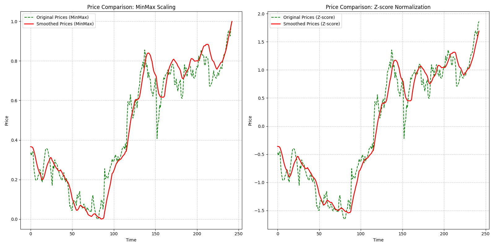

# 연속된 window

단순히 data rolling window를 하는 것은 다음과 같은 문제를 유발할 수 있다.  
* [ 9 1 2 3 4 5 6 7 8 ] 데이터에서 1이 추가된다면 [ 1 2 3 4 5 6 7 8 1] 이 된다.
* Min-Max든, Standard scale이든 문제가 발생한다. 학습한 값과 차이가 나는 것이다. 분포 자첵 바뀐다.

물론, 위 점들을 모두 성공적으로 학습하여 괜찮은 결과를 내지만, 이러한 변수도 해결해야한다.  
일종의 Smoothing이 필요하다.

Smooth를 할 경우 빨간 선 처럼 잡음이 대부분 상쇄된다. 즉, smooth 처리가 된 상태라면 window로 잘랐을 때 발생하는 스케일링 문제도 해결될 수 있다.